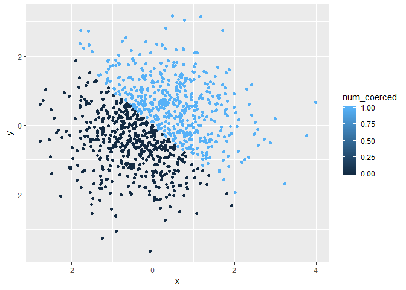

p8105\_hw\_fwt2107
================
Felix Tran
September 16, 2018

Problem 1
=========

Creating the dataframe
----------------------

We will create a dataframe with 4 entries for problem 1. We initialize the 4 entries first.

random\_sample is a vector of 10 random numbers from a uniform distribution \[0, 5\].

logic\_vector is a vector showing which numbers in random\_sample are greater than 2.

char\_vector is a character vector of length 10.

factor\_vector is a factor of length 10.

``` r
random_sample <- runif(10, min = 0, max = 5)
logic_vector <- 2 > random_sample
char_vector <- vector(mode = "character", length = 10)
factor_vector <- factor(c(vector(length = 10)))
```

prob1\_dataframe is created containing the 4 vectors

``` r
library(tibble)
prob1_dataframe <- data_frame(
  random_sample,
  logic_vector,
  char_vector,
  factor_vector
)
```

Calculating the means of each vector
------------------------------------

The mean can be calculate for random\_sample and logic\_vector because their values are either numeric or logical

``` r
mean(prob1_dataframe$random_sample)
```

    ## [1] 2.625568

``` r
mean(prob1_dataframe$logic_vector)
```

    ## [1] 0.4

However, the mean cannot be calculated for char\_vector and factor\_vector because their values are not numeric nor logical

``` r
mean(prob1_dataframe$char_vector)
```

    ## Warning in mean.default(prob1_dataframe$char_vector): argument is not
    ## numeric or logical: returning NA

    ## [1] NA

``` r
mean(prob1_dataframe$factor_vector)
```

    ## Warning in mean.default(prob1_dataframe$factor_vector): argument is not
    ## numeric or logical: returning NA

    ## [1] NA

Converting variable types
-------------------------

Applying the as.numeric function to logic\_vector converts the TRUE values into 1's and the FALSE values into 0's. Applying the as.numeric function to char\_vector converts all the "" entries into NA's. Applying the as.numeric function to factor\_vector converts all the values into 1's.

``` r
as.numeric(logic_vector)
as.numeric(char_vector)
as.numeric(factor_vector)
```

We convert char\_vector from character vector to factor to numeric. This gives us a numeric vector with all entries = 1. We also convert factor\_vector from factor to character vector to numeric. This gives us a vector with all entires NA.

``` r
as.numeric(as.factor(char_vector))
```

    ##  [1] 1 1 1 1 1 1 1 1 1 1

``` r
as.numeric(as.character(factor_vector))
```

    ## Warning: NAs introduced by coercion

    ##  [1] NA NA NA NA NA NA NA NA NA NA

Problem 2
=========

Creating the dataframe
----------------------

We first create the vectors we will eventually combine for our dataframe.

x is a random sample of 1000 numbers from the standard normal distribution. y is a random sample of 1000 numbers from the standard normal distribution. logic\_vector is a vector of logic values indicating if x + y &gt; 0. num\_coerced is logic\_vector coereced as a numeric vector. factor\_coerced is logic\_vector coerced as a factor.

``` r
x <- rnorm(1000)
y <- rnorm(1000)
logic_vector <- (x + y) > 0
num_coerced <- as.numeric(logic_vector)
factor_coerced <- as.factor(logic_vector)
```

We create the dataframe containing the vectors we just created.

``` r
plot_df <- data_frame(
  x,
  y,
  logic_vector,
  num_coerced,
  factor_coerced
)
```

This dataframe is named plot\_df. It has 1000 rows and 5 columns. The mean of x is -0.0179368, and the median of x is -0.0068016. The proportion of cases in logic\_vector which are TRUE is 48.2%.

This is the first of 3 scatterplots of y vs x. The points with coordinates (x, y) in which x + y &gt; 0 are one color, and the remaining points are a different color. These 2 colors are the only 2 colors used in the color scale.

``` r
library('ggplot2')
logic_ggplot <- ggplot(plot_df, aes(x = x, y = y, color = logic_vector)) + 
  geom_point()
logic_ggplot
```


This is the second scatterplot of y vs x. The points with coordinates (x, y) in which x + y &gt; 0 are one color, and the remaining points are a different color. The color scale uses a gradient, but because there are only two different numeric values in num\_coerced only two shades of the scale are used.

``` r
num_ggplot <- ggplot(plot_df, aes(x = x, y = y, color = num_coerced)) + 
  geom_point()
num_ggplot
```



This is the third scatterplot of y vs x. The points with coordinates (x, y) in which x + y &gt; 0 are one color, and the remaining points are a different color. Like the first scatterplot which used logic\_vector for its color scale, these 2 colors are the only 2 colors used in the color scale.

``` r
factor_ggplot <- ggplot(plot_df, aes(x = x, y = y, color = factor_coerced)) + 
  geom_point()
factor_ggplot
```


We save the first scatterplot.

``` r
ggsave(plot = logic_ggplot, filename = 'logic_scatterplot.pdf')
```

    ## Saving 7 x 5 in image
